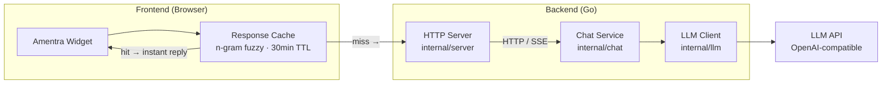

# Amentra

[](https://github.com/riski/ai-chat/actions/workflows/ci.yml)
[](https://github.com/riski/ai-chat/actions/workflows/ci.yml)

> **Intelligence that adapts to your context**

*Amentra* — from *Amenti* (ancient Egyptian), a hidden realm of knowledge. An invisible intelligence layer that connects users to the right knowledge, in the right context.

| Part | Meaning |
|---|---|
| **Ament** | hidden / behind-the-scenes |
| **-ra** | energy / system / activation |

Scoped multi-app AI platform — monorepo with Go backend + frontend web component.

## Structure

```
backend/       — Go API server (see backend/README)
frontend/      — SPA frontend (see frontend/README)
```

## System Architecture




```
  Frontend                Backend (Go)              External
 ┌──────────────┐       ┌──────────────────┐      ┌──────────┐
 │ @amentra/    │       │ HTTP Server      │      │  LLM API │
 │  react  vue  │       │ internal/server  │      │ (OpenAI- │
 │    ↘   ↙     │       └──────┬───────────┘      │ compat)  │
 │  Amentra     │──HTTP─→      │                   └────▲─────┘
 │  Widget      │   /SSE       │                        │
 │              │              ↓                        │
 └──────────────┘       ┌──────────────┐                │
                        │ Chat Service │──OpenAI────────┘
                        │ internal/    │
                        │   chat       │
                        └──────────────┘
```


## Quick Start

```bash
cd backend && make dev
```

## Backend

Config-driven, stateless, streaming chat API backed by any OpenAI-compatible LLM. See [backend/README.md](backend/README.md).

## Frontend

[Amentra Widget](frontend/README.md) — embeddable Lit web component with React and Vue wrappers.
