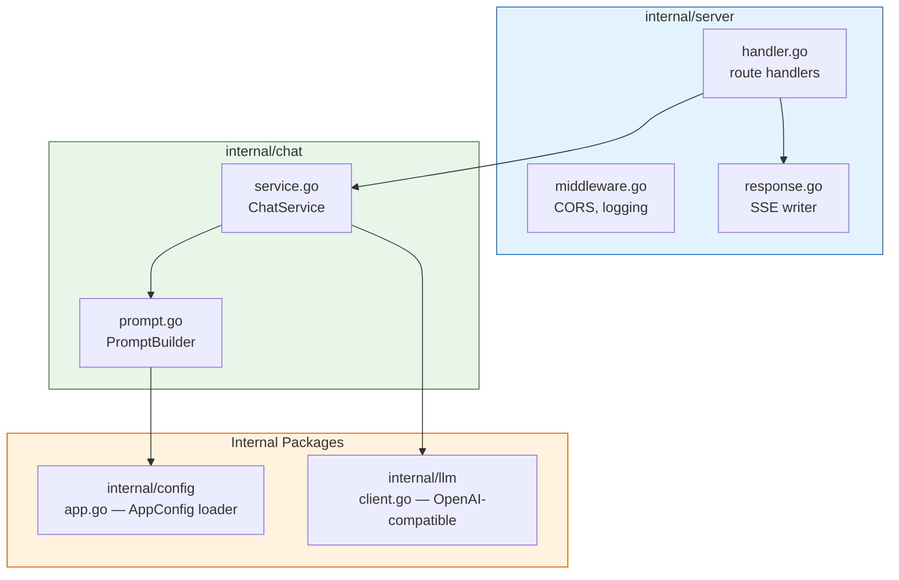

# Backend — Amentra API

## Architecture

### Package Dependency



```
┌────────────────────────────────────────────────┐
│  internal/server                                │
│  ┌──────────┐                                   │
│  │ handler  │──→ response.go (SSE writer)       │
│  │  .go     │                                   │
│  └─────┬────┘                                   │
│        │ middleware.go (CORS, logging)           │
└────────┼────────────────────────────────────────┘
         │
         ↓
┌───────────────── internal/chat ─────────────────┐
│  ┌──────────────┐      ┌──────────────────┐     │
│  │ ChatService  │─────→│ PromptBuilder    │     │
│  │ service.go   │      │ prompt.go        │     │
│  └──┬───┬───┬───┘      └────────┬─────────┘     │
│     │   │   │                    │               │
│     │   │   │                    ↓               │
│     │   │   │            ┌────────────┐          │
│     │   │   │            │ AppConfig  │          │
│     │   │   │            │ configs/*  │          │
│     │   │   │            └────────────┘          │
└─────┼───────────────────────────────────────────┘
      │
      │
      ↓
      ┌──────────────┐
      │ LLM Client   │
      │  ─→ LLM API   │
      │ (OpenAI-compat)│
      └──────────────┘
```

### Request Lifecycle

1. **HTTP handler** (`internal/server/handler.go`) receives `POST /chat` or `POST /chat-stream`
2. **Request validation** — `Req.Validate()` checks required fields and message length
3. **ChatService** (`internal/chat/service.go`) loads app config via `config.Loader`
4. **PromptBuilder** (`internal/chat/prompt.go`) loads app config from `configs/*.json` — if scope is non-empty, injects "You ONLY answer" restriction; always injects knowledge from `data/knowledge/<app_id>/*.md` → assembles system + user messages from summary + recent + current message
5. **LLM Client** (`internal/llm/client.go`) sends the completion request to any OpenAI-compatible API (configurable via `AI_BASE_URL`) — streaming via SSE or non-streaming
6. Reply is written back through the handler — JSON response or SSE event stream

### Design Properties

- **Config-driven** — each app has its own system prompt + scope (see `configs/_sample.json`)
- **Hybrid memory** — client sends summary + recent messages; backend is stateless
- **Streaming** — SSE via `POST /chat-stream`
- **Knowledge injection** — app-specific markdown files read from `data/knowledge/<app_id>/`

## Endpoints

| Method | Path | Description |
|---|---|---|
| POST | `/chat` | Non-streaming chat |
| POST | `/chat-stream` | Streaming chat (SSE) |
| POST | `/summary` | Update conversation summary |

## Usage

```bash
cp .env.example .env   # set AI_API_KEY, AI_BASE_URL, LLM_MODEL
make dev
```

## Environment

| Variable | Default | Description |
|---|---|---|
| `AI_API_KEY` | — | API key for the LLM provider |
| `AI_BASE_URL` | `https://openrouter.ai/api/v1` | Base URL for any OpenAI-compatible API |
| `LLM_MODEL` | `openrouter/free` | Model identifier (e.g. `gpt-3.5-turbo`, `anthropic/claude-3`) |

## Config Schema

Each app is configured in `configs/<app_id>.json`:

```json
{
  "app_id": "your-app-id",
  "name": "Your App Name",
  "scope": ["topic1", "topic2"],
  "tone": "professional",
  "fallback_message": "I can only answer about: topic1, topic2.",
  "system_prompt": "You are an assistant for ..."
}
```

| Field | Required | Description |
|---|---|---|
| `app_id` | Yes | Unique identifier matching the filename |
| `name` | Yes | Display name for the assistant |
| `scope` | No | If non-empty, restricts the assistant to these topics |
| `tone` | No | Tone hint (e.g. `professional`, `casual`) |
| `fallback_message` | No | Response when question is outside scope |
| `system_prompt` | No | Override the default system prompt |

## Validation

Incoming requests are validated before processing:

- `app_id` — required
- `message` — max 1000 characters
- `recent_messages` — max 10 entries
- Invalid requests return `400` with a JSON error body

## Request Samples

**POST /chat** — non-streaming

Request:

```json
{
  "app_id": "your-app-id",
  "message": "Pertanyaan Anda",
  "summary": "",
  "recent_messages": []
}
```

Response:

```json
{
  "reply": "Jawaban dari asisten...",
  "summary": "Ringkasan percakapan..."
}
```

**POST /chat-stream** — streaming (SSE)

Request:

```json
{
  "app_id": "your-app-id",
  "message": "Pertanyaan Anda",
  "summary": "",
  "recent_messages": []
}
```

Response stream (JSON SSE events):

```
data: {"type":"token","content":"Halo"}
data: {"type":"token","content":" dunia"}
data: {"type":"done","reply":"Halo dunia","summary":"updated summary"}
data: {"type":"error","message":"error message"}
```

Curl for testing:

```bash
curl -N http://localhost:8080/chat-stream \
  -H "Content-Type: application/json" \
  -d '{"app_id":"your-app-id","message":"Halo","summary":"","recent_messages":[]}'
```

**POST /summary** — update summary

Request:

```json
{
  "app_id": "your-app-id",
  "summary": "Ringkasan percakapan sebelumnya...",
  "message": "Pesan terakhir user",
  "recent_messages": []
}
```

Response:

```json
{
  "summary": "Ringkasan yang diperbarui..."
}
```

## Configuration

Copy the sample and edit:

```bash
cp configs/_sample.json configs/my-app.json
# edit with your app's details
```

## Knowledge

App-specific knowledge lives in `data/knowledge/<app_id>/*.md`.  
The `PromptBuilder` reads these files and injects them into the system prompt.

Sample:

```bash
cp -r data/knowledge/_sample data/knowledge/my-app
# edit the markdown files with your own content
```

Each `.md` file becomes a section under `Knowledge:` in the system prompt.

## Adding a new app

1. Create `configs/<app_id>.json` (copy from `_sample.json`)
2. Create `data/knowledge/<app_id>/` with your `.md` files
3. Restart the server

## Why raw HTTP instead of an OpenAI SDK?

The LLM client (`internal/llm`) calls the OpenAI-compatible API using `net/http`
directly — no SDK, no generated client. Reasons:

- **Zero dependencies** — no vendored API types, no generated stubs, no indirect
  dependency CVEs to track
- **Vendor-portable** — the same code works with any OpenAI-compatible provider
  (OpenRouter, Anthropic, local LLM servers like Ollama, etc.) without swapping
  SDKs
- **Small surface** — the entire client is ~190 lines covering chat completion +
  streaming. An SDK would add 10–20× more code for features we don't use (tool
  calls, embeddings, fine-tuning, image generation, ...)
- **No `go.mod` bloat** — switching from `openai-go` to raw HTTP dropped ~30
  indirect dependencies

## Stack

Go 1.26, any OpenAI-compatible LLM (OpenRouter, Anthropic, Ollama, ...).
