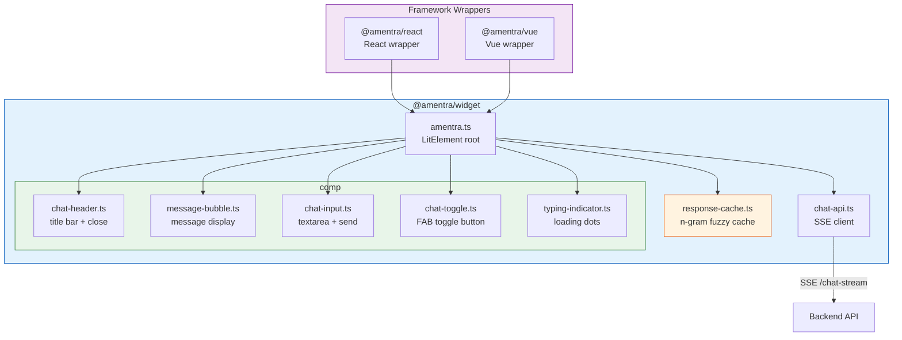

# Amentra — Frontend

Embeddable [Amentra Widget](https://github.com/riskizulfiansyah/amentra) — built with [Lit](https://lit.dev/), Tailwind CSS, and TypeScript. Framework-agnostic via Web Components, with optional React and Vue wrappers.

## Architecture

```
frontend/
├── packages/
│   ├── widget/         @amentra/widget   — Lit web component (core)
│   ├── react/          @amentra/react    — React wrapper
│   └── vue/            @amentra/vue      — Vue wrapper
├── demo/               @amentra/demo     — Vite demo app
└── package.json        workspace root
```

### Component Dependency



```
@amentra/react   @amentra/vue
        ↘           ↙
     ┌─────────────────┐
     │  amentra.ts     │
     │  (LitElement)   │
     └───┬───┬───┬───┬─┘
        │   │   │   │
        ↓   ↓   ↓   ↓
  ┌────┐ ┌───┐ ┌───┐ ┌───────────┐
  │hdr │ │msg│ │inp│ │ toggle    │
  │.ts │ │.ts│ │.ts│ │ .ts       │
  └────┘ └───┘ └───┘ └───────────┘
        │               │
        ↓               ↓
  ┌──────────┐    ┌───────────────┐  ┌────────────────┐
  │ typing   │    │  chat-api.ts  │  │ response-cache │
  │ .ts      │    │ (SSE client)  │  │ .ts (fuzzy)    │
  └──────────┘    └──────┬────────┘  └────────────────┘
                         │
                     SSE │ /chat-stream
                         ↓
                   ┌────────────┐
                   │ Backend API│
                   └────────────┘
```

### Data Flow

1. User types a message in **ChatInput** → dispatched via Lit event
2. **amentra.ts** root receives the event → checks **response-cache.ts** for fuzzy n-gram match
3. **Cache hit** → instant reply shown (no API call). **Cache miss** → calls **ChatApi.send()**
4. **ChatApi** opens an SSE connection to `POST /chat-stream`
5. SSE events (`token`, `done`, `error`) are dispatched back as Lit events
6. **amentra.ts** updates state → **MessageBubble** re-renders with new tokens
7. On `done`, response is cached via **response-cache.ts** (trigram Jaccard similarity ≥ 0.7, 30 min TTL) and conversation persisted to `localStorage`

## Prerequisites

- [Bun](https://bun.sh) v1.3+

## Getting started

```bash
bun install
bun run dev        # builds widget → starts demo on http://localhost:5173
bun run build      # builds all distributable packages
```

## Usage

### Plain HTML (any framework)

```html
<script type="module" src="https://cdn.example.com/@amentra/widget/dist/index.js"></script>
<amentra-widget app-id="my-app" api-base-url="http://localhost:8080"></amentra-widget>
```

### React

```bash
bun add @amentra/react
```

```tsx
import { AmentraWidget } from '@amentra/react'

function App() {
  return <AmentraWidget appId="app-id" apiBaseUrl="http://localhost:8080" />
}
```

### Vue 3

```bash
bun add @amentra/vue
```

```vue
<template>
  <AmentraWidget app-id="app-id" api-base-url="http://localhost:8080" />
</template>

<script setup>
import { AmentraWidget } from '@amentra/vue'
</script>
```

## API Reference

### Attributes

| Attribute       | Type    | Default                     | Description               |
|-----------------|---------|-----------------------------|---------------------------|
| `app-id`        | string  | `""`                        | App config identifier     |
| `api-base-url`  | string  | `http://localhost:8080`     | Backend API base URL      |
| `title`         | string  | `Chat Assistant`            | Dialog header title       |
| `theme-color`   | string  | `#3b82f6`                   | Primary color (any CSS color) |
| `placeholder`   | string  | `Type a message...`         | Input placeholder         |
| `max-chars`     | number  | `1000`                      | Max input length          |
| `open`          | boolean | `false`                     | Open chat dialog on mount |

### Events

| Event             | Detail                         | Description              |
|-------------------|--------------------------------|--------------------------|
| `message-sent`    | `{ text: string }`             | User sent a message      |
| `message-received`| —                              | Assistant replied        |
| `error`           | `{ error: string }`            | Stream or API error      |
| `open-change`     | `{ open: boolean }`            | Dialog opened/closed     |

### CSS Parts

| Part              | Description                    |
|-------------------|--------------------------------|
| `dialog`          | Chat panel container           |
| `header`          | Title bar                      |
| `close-button`    | Close/minimize button          |
| `input`           | Message textarea               |
| `send-button`     | Send button                    |
| `error-banner`    | Error notification bar         |
| `toggle-button`   | Floating action button         |

## Theming

### Via attribute

```html
<amentra-widget app-id="my-app" theme-color="#1e3a5f"></amentra-widget>
```

### Via CSS custom property

```css
amentra-widget {
  --amentra-primary: #1e3a5f;
}
```

The `--amentra-primary` CSS var controls: header background, toggle button, send button, user message bubbles, and empty state icon. A hardcoded `#3b82f6` fallback is used when the var isn't set.

The CSS var method is useful when attributes are hard to reach (e.g., framework wrappers) or when multiple widgets need different colors on the same page.

## Customization

### Colors

All accent colors derive from a single `--amentra-primary` CSS custom property. Set it on the `<amentra-widget>` element or any ancestor:

```css
amentra-widget {
  --amentra-primary: #1e3a5f;
}
```

To customize specific elements further, use CSS parts:

```css
amentra-widget::part(header) {
  background: linear-gradient(135deg, #1e3a5f, #2d5a87);
}

amentra-widget::part(send-button) {
  background: #2d5a87;
  border-radius: 8px;
}
```

Available parts: `dialog`, `header`, `close-button`, `input`, `send-button`, `error-banner`, `toggle-button`.

### Layout

The chat dialog:

- **Desktop**: `max-h-[calc(100vh-120px)]` — fills available viewport with 120px bottom clearance
- **Mobile**: `h-[100dvh]` — full screen, no rounded corners
- **Width**: 380px on desktop, full width on mobile

The messages area scrolls independently; the page body won't scroll when the widget is open.

### Input

- Enter sends, Shift+Enter inserts a newline
- Character limit is configurable via `max-chars` attribute (default 1000)
- Textarea auto-resizes up to 128px height

## Local persistence

- **Conversation**: saved to `localStorage` under key `amentra:<app-id>` — messages and summary survive page reloads.
- **Response cache**: cached replies stored in `localStorage` with **30-minute TTL**. Fuzzy n-gram matching (trigram Jaccard similarity ≥ 0.7) catches reworded questions without an API call.

## Local development

To test the widget in another project before publishing:

```bash
# In frontend root
cd packages/widget
bun link

# In your other project
bun link @amentra/widget
```

## Build output

| Package          | Size       | Format |
|------------------|------------|--------|
| `@amentra/widget`| ~39 KB     | ESM    |
| `@amentra/react` | ~0.5 KB    | ESM    |
| `@amentra/vue`   | ~1 KB      | ESM    |
